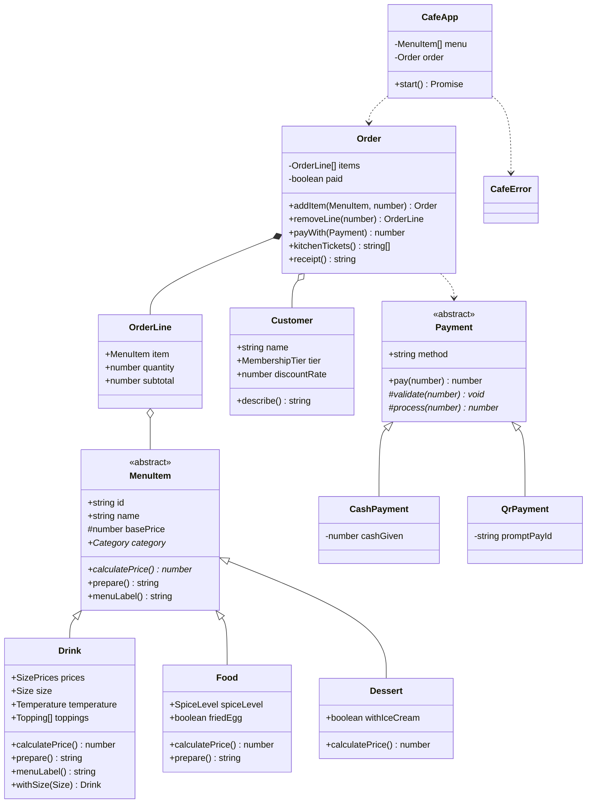

# ☕ Cafe OOP — ระบบสั่งอาหารร้านคาเฟ่

มินิโปรเจกต์วิชา **Object-Oriented Programming** เขียนด้วย **TypeScript** รันบน Node.js
ระบบ POS ของร้านคาเฟ่แบบโต้ตอบ: พิมพ์เลขเลือกเมนู ปรับแต่งสินค้า คิดส่วนลดสมาชิก ชำระเงิน และออกใบเสร็จ

**12 คลาส · 10 ไฟล์ · ~980 บรรทัด**

---

## วิธีรัน

```bash
npm install     # ติดตั้ง TypeScript
npm start       # คอมไพล์แล้วเปิดหน้าจอสั่งอาหาร
```

```bash
npm run build      # คอมไพล์ TypeScript -> dist/
npm run typecheck  # ตรวจ type อย่างเดียว ไม่สร้างไฟล์
```

> **หมายเหตุ:** ต้องคอมไพล์ด้วย `tsc` ก่อนรัน เพราะใช้ `enum` และ parameter property
> (`constructor(readonly x: string)`) ซึ่งโหมด strip-only ของ Node (`node file.ts`) ยังไม่รองรับ

---

## คลาสทั้งหมด (12 คลาส)

| # | คลาส | ไฟล์ | หน้าที่ |
|---|---|---|---|
| 1 | `MenuItem` *(abstract)* | MenuItem.ts | คลาสแม่ของสินค้าทุกชนิด |
| 2 | `Drink` | Drink.ts | เครื่องดื่ม — ราคาแยกทุกไซส์ S/M/L / ร้อน-เย็น-ปั่น / ท็อปปิ้ง |
| 3 | `Food` | Food.ts | อาหาร — ระดับความเผ็ด / ไข่ดาว |
| 4 | `Dessert` | Dessert.ts | ของหวาน — เพิ่มไอศกรีม |
| 5 | `Customer` | Customer.ts | ลูกค้า — ระดับสมาชิกและอัตราส่วนลด |
| 6 | `Payment` *(abstract)* | Payment.ts | คลาสแม่ของวิธีชำระเงิน |
| 7 | `CashPayment` | Payment.ts | จ่ายเงินสด (คิดเงินทอน) |
| 8 | `QrPayment` | Payment.ts | จ่ายผ่าน QR พร้อมเพย์ |
| 9 | `OrderLine` | Order.ts | หนึ่งบรรทัดในบิล (สินค้า x จำนวน) |
| 10 | `Order` | Order.ts | บิลหนึ่งใบ — คิดส่วนลดและออกใบเสร็จ |
| 11 | `CafeError` | utils.ts | Custom Exception ของระบบ |
| 12 | `CafeApp` | CafeApp.ts | หน้าจอ CLI — คุยกับผู้ใช้อย่างเดียว |

นอกจากนี้มี **enum 5 ตัว** (`Category`, `Size`, `Temperature`, `SpiceLevel`, `MembershipTier`)

---

## UML Class Diagram



---

## แนวคิด OOP ที่ใช้

| แนวคิด | ใช้ที่ไหน | อธิบาย |
|---|---|---|
| **Abstraction** | `MenuItem`, `Payment` | 2 abstract class บอกว่า "ต้องทำอะไรได้" โดยไม่บอกวิธี สร้าง object จากคลาสแม่ตรง ๆ ไม่ได้ |
| **Inheritance** | `MenuItem → Drink/Food/Dessert`, `Payment → CashPayment/QrPayment` | 2 ลำดับชั้น คลาสลูกได้ field และ method ของแม่มาใช้ฟรี |
| **Polymorphism** | `calculatePrice()`, `prepare()`, `pay()` | จุดที่ชัดสุดคือ `Order.kitchenTickets()` — วนลูปเรียก `item.prepare()` ตัวเดียว แต่ได้ข้อความของบาร์ ของครัว หรือของหวาน ตามชนิดสินค้าจริง **ไม่มี `if` เช็คชนิดเลย** |
| **Encapsulation** | `Order.items`, `MenuItem.basePrice`, `CashPayment.cashGiven` | ข้อมูลสำคัญเป็น `private` แก้ได้แค่ผ่าน method ที่ตรวจเงื่อนไขให้ — ข้างนอก `push` ของแถมเข้าบิลไม่ได้ เพราะ getter `lines` คืนสำเนา และ `Customer.tier` เป็น `readonly` ลูกค้าอัปเกรดตัวเองเป็นสมาชิกทองไม่ได้ |
| **Composition** | `Order` มี `OrderLine[]`, `OrderLine` มี `MenuItem` | ความสัมพันธ์แบบ has-a |
| **Method Overriding** | `override` ทุกจุดในคลาสลูก | เปิด `noImplicitOverride` ใน tsconfig ลืมใส่ `override` แล้วคอมไพล์ไม่ผ่าน |
| **Custom Exception** | `CafeError` | `CafeApp` จับที่เดียวด้วย `if (error instanceof CafeError)` แล้ววนกลับเมนู โปรแกรมไม่ตาย |
| **Template Method** | `Payment.pay()` | คลาสแม่คุมลำดับ (ตรวจข้อมูล → ตัดเงิน) เปิดให้คลาสลูกเติมแค่จุดที่ต่างกันจริง |
| **Immutability** | `Drink.withSize()` ฯลฯ | `with...()` คืน object ใหม่ ทำให้เมนูต้นฉบับในร้านไม่เพี้ยนเวลาลูกค้าสั่งแบบพิเศษ |
| **แยกชั้น UI / Domain** | `CafeApp` กับคลาสอื่น | `CafeApp` รับข้อมูลจากผู้ใช้เท่านั้น การคิดเงินอยู่ในคลาส domain ทั้งหมด |

---

## วิธีใช้งาน

เปิดโปรแกรมแล้วกรอกชื่อลูกค้า (Enter ข้าม = ลูกค้าทั่วไป ไม่มีส่วนลด) จากนั้นพิมพ์เลขเลือกเมนู

```
==============================================
  บิล A001 | 3 ชิ้น | ยอด 243 บาท
==============================================
  1) ดูเมนู
  2) สั่งของเข้าบิล
  3) ดูบิลปัจจุบัน
  4) ลบรายการในบิล
  5) ชำระเงิน
  0) ปิดร้าน

เลือก: _
```

ตอนสั่งของ โปรแกรมจะถามตัวเลือกให้ตรงกับชนิดสินค้าที่เลือก

| สินค้า | ถามอะไร |
|---|---|
| เครื่องดื่ม (D01–D05) | ไซส์ S/M/L → ร้อน/เย็น(+10)/ปั่น(+20) → ท็อปปิ้ง → จำนวน |
| อาหาร (F01–F05) | ระดับความเผ็ด (เฉพาะเมนูที่เลือกเผ็ดได้) → เพิ่มไข่ดาว (+10) ไหม → จำนวน |
| ของหวาน (S01–S03) | เพิ่มไอศกรีม (+25) ไหม → จำนวน |

**ราคาเครื่องดื่ม** กำหนดแยกทุกไซส์ ไม่ได้คิดเป็นเปอร์เซ็นต์

| เมนู | S | M | L |
|---|---|---|---|
| ลาเต้ | 45 | 50 | 55 |
| อเมริกาโน่ | 40 | 45 | 50 |
| มัทฉะลาเต้ | 55 | 60 | 65 |
| ชาไทย | 40 | 45 | 50 |
| โกโก้ | 50 | 55 | 60 |

**ทั้งระบบเป็นจำนวนเต็มบาท ไม่มีสตางค์**
- ราคาทุกสินค้าต้องเป็นจำนวนเต็ม — `MenuItem` ตรวจตั้งแต่ตอนสร้าง ใส่ `45.5` จะโยน error ทันที
- ราคาในเมนู**รวม VAT แล้ว** ไม่บวกเพิ่มท้ายบิล
- ส่วนลดสมาชิก (ทั่วไป 0% / เงิน 5% / ทอง 10%) **ปัดเศษทิ้ง** — เช่น 10% ของ 269 = 26.9 → ลด 26 บาท
- รับเงินสดเป็นจำนวนเต็มเท่านั้น

แคชเชียร์เลือกระดับสมาชิกตอนเปิดบิล

**ชำระเงิน:** เงินสด (คิดเงินทอนให้) หรือ QR พร้อมเพย์ (ต้องใส่เบอร์ 10 หรือ 13 หลัก)

ตัวอย่างใบเสร็จ

```
============================================
        CAFE OOP - ใบเสร็จรับเงิน
============================================
เลขที่บิล : A001
ลูกค้า    : สมชาย [สมาชิกทอง]
--------------------------------------------
1. 2 x ลาเต้ (เย็น, แก้ว L) + เอสเพรสโซช็อตพิเศษ
   85 บาท x 2                        170 บาท
2. 1 x ข้าวผัดกุ้ง (เผ็ดน้อย) + ไข่ดาว
   99 บาท x 1                         99 บาท
--------------------------------------------
ราคารวม                              269 บาท
  ส่วนลด สมาชิกทอง 10%               -26 บาท
--------------------------------------------
ยอดชำระ (รวม VAT แล้ว)               243 บาท
ชำระโดย เงินสด
เงินทอน                              257 บาท
============================================
```

---

## การจัดการข้อผิดพลาด

ลองทำสิ่งเหล่านี้ตอนรัน โปรแกรมจะบอกว่าผิดอะไรแล้ววนกลับเมนู ไม่ crash

| ทำอะไร | ข้อความที่ได้ |
|---|---|
| สั่งโกโก้ 5 แก้ว (เหลือ 2) | `!! "โกโก้" มีไม่พอ (ขอ 5 เหลือ 2)` |
| สั่งจำนวน 0 หรือติดลบ | `!! จำนวนต้องเป็นเลขจำนวนเต็มมากกว่า 0` |
| กดชำระเงินตอนบิลว่าง | `!! บิลนี้ยังไม่มีรายการสินค้า` |
| จ่ายเงินสดน้อยกว่ายอด | `!! จ่ายเงินไม่พอ (ต้องจ่าย 243 บาท ได้รับ 100 บาท)` |
| จ่ายเงินสดมีเศษสตางค์ เช่น 100.50 | `!! รับเงินเป็นจำนวนเต็มบาทเท่านั้น (ร้านไม่รับสตางค์)` |
| ใส่เบอร์พร้อมเพย์ผิดรูปแบบ | `!! เบอร์พร้อมเพย์ต้องเป็นเบอร์โทร 10 หลัก...` |

---

## ไอเดียต่อยอด (ถ้าอาจารย์ให้ทำเพิ่ม)

- **เพิ่มวิธีจ่ายเงิน** — `CardPayment extends Payment` ที่ซ่อนเลขบัตรเหลือ 4 ตัวท้าย (เพิ่มคลาสเดียว ไม่ต้องแก้ `Order`)
- **เมนูเซ็ต (Combo)** — `ComboSet extends MenuItem` ที่ข้างในมี `MenuItem[]` (Composite Pattern)
- **บันทึกยอดขายลงไฟล์** — เพิ่ม interface `Storage` แล้วทำ `JsonFileStorage`
- **Unit Test** — ใช้ `node --test` ทดสอบการคิดราคาของแต่ละคลาสลูก
