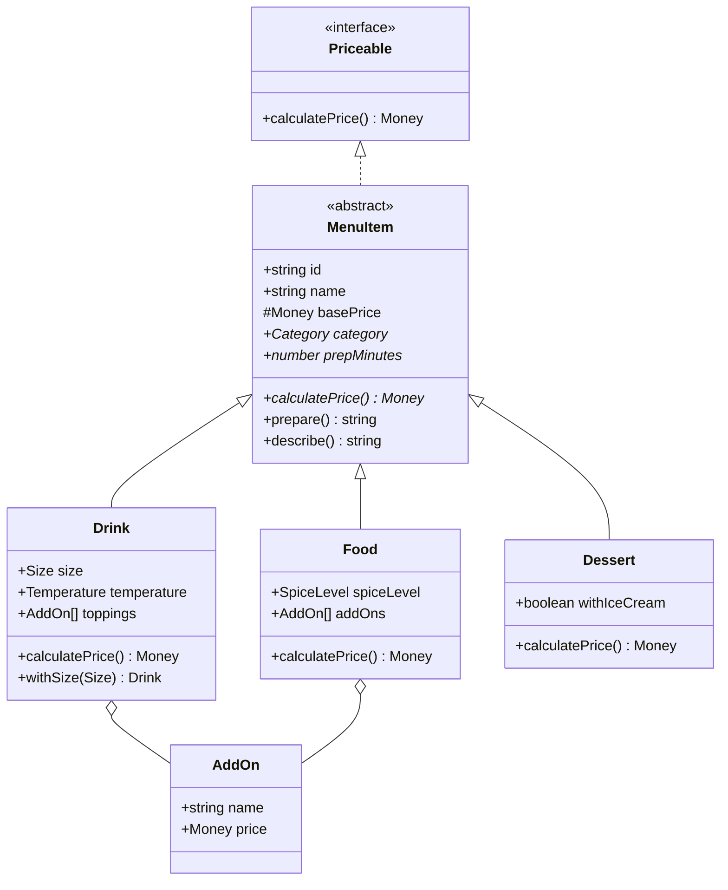
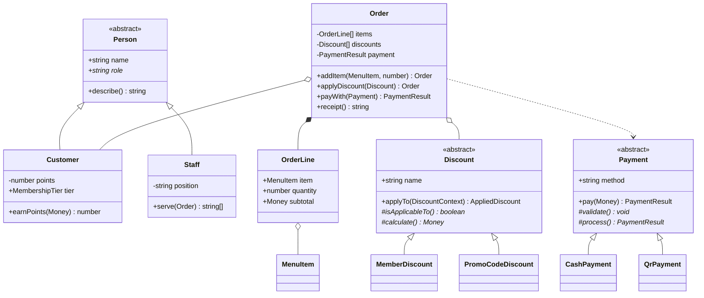

# ☕ Cafe OOP — ระบบสั่งอาหารร้านคาเฟ่

มินิโปรเจกต์วิชา **Object-Oriented Programming** เขียนด้วย **TypeScript** รันบน Node.js
เป็นระบบ POS ของร้านคาเฟ่แบบโต้ตอบ: พิมพ์เลขเลือกเมนู ปรับแต่งสินค้า ใส่โค้ดส่วนลด ชำระเงิน และออกใบเสร็จ

---

## วิธีรัน

```bash
npm install     # ติดตั้ง TypeScript
npm start       # คอมไพล์แล้วเปิดหน้าจอสั่งอาหาร
```

คำสั่งอื่น

```bash
npm run build      # คอมไพล์ TypeScript -> dist/
npm run typecheck  # ตรวจ type อย่างเดียว ไม่สร้างไฟล์
```

> **หมายเหตุ:** ต้องคอมไพล์ด้วย `tsc` ก่อนรัน เพราะใช้ `enum` และ parameter property
> (`constructor(readonly x: string)`) ซึ่งโหมด strip-only ของ Node (`node file.ts`) ยังไม่รองรับ

---

## วิธีใช้งาน

เปิดโปรแกรมแล้วกรอกชื่อลูกค้า (กด Enter ข้ามได้ = ลูกค้าทั่วไป ไม่สะสมแต้ม) จากนั้นพิมพ์เลขเลือกเมนู

```
==============================================
  บิล A001 | 3 ชิ้น | ยอด 280.23 บาท
==============================================
  1) ดูเมนู
  2) สั่งของเข้าบิล
  3) ดูบิลปัจจุบัน
  4) ลบรายการในบิล
  5) ใส่โค้ดส่วนลด
  6) ชำระเงิน
  0) ปิดร้าน

เลือก: _
```

**ตอนสั่งของ** โปรแกรมจะถามตัวเลือกให้ตรงกับชนิดสินค้าที่เลือก

| สินค้า | ถามอะไร |
|---|---|
| เครื่องดื่ม (D01–D05) | ขนาดแก้ว S/M/L → ร้อน/เย็น/ปั่น → ท็อปปิ้ง → จำนวน |
| อาหาร (F01–F03) | ระดับความเผ็ด → เพิ่มไข่ดาวไหม → จำนวน |
| ของหวาน (S01–S03) | เพิ่มไอศกรีมไหม → จำนวน |

**โค้ดส่วนลด:** `OPEN5` (ลด 5% เมื่อครบ 300) และ `SAVE10` (ลด 10% เมื่อครบ 500)

**สมาชิก** ได้ส่วนลดอัตโนมัติทุกบิล — เงิน 5% / ทอง 10%
(ใช้จ่าย 20 บาท = 1 แต้ม, 200 แต้ม = สมาชิกเงิน, 500 แต้ม = สมาชิกทอง)

**ชำระเงิน:** เงินสด (คิดเงินทอนให้) หรือ QR พร้อมเพย์ (ต้องใส่เบอร์ 10 หรือ 13 หลัก)

ตัวอย่างใบเสร็จที่ได้

```
============================================
        CAFE OOP - ใบเสร็จรับเงิน
============================================
เลขที่บิล : A001
ลูกค้า    : สมชาย [สมาชิกทอง - 534 แต้ม]
--------------------------------------------
1. 2 x ลาเต้ (เย็น, แก้ว L) + เอสเพรสโซช็อตพิเศษ
   96.00 บาท x 2                  192.00 บาท
2. 1 x ข้าวผัดกุ้ง (เผ็ดน้อย) + ไข่ดาว
   99.00 บาท x 1                   99.00 บาท
--------------------------------------------
ราคารวม                           291.00 บาท
  ส่วนลดสมาชิก                    -29.10 บาท
หลังหักส่วนลด                     261.90 บาท
VAT 7%                             18.33 บาท
--------------------------------------------
ยอดชำระ                           280.23 บาท
เงินสด                           1000.00 บาท
เงินทอน                           719.77 บาท
============================================
```

---

## โครงสร้างโปรเจกต์ (12 ไฟล์)

```
src/
├── core/
│   ├── Money.ts        Value Object ของจำนวนเงิน (เก็บเป็นสตางค์, immutable)
│   └── errors.ts       Custom Exception 5 คลาส สืบทอดจาก CafeError
│
├── menu/
│   ├── MenuItem.ts     ★ abstract class แม่ของสินค้า + interface Priceable + AddOn
│   ├── Drink.ts        เครื่องดื่ม (ขนาดแก้ว / ร้อน-เย็น-ปั่น / ท็อปปิ้ง)
│   ├── Food.ts         อาหาร (ระดับความเผ็ด / ของเพิ่ม)
│   └── Dessert.ts      ของหวาน (เพิ่มไอศกรีม)
│
├── people/
│   └── Person.ts       ★ abstract Person + Customer (แต้มสะสม) + Staff
│
├── order/
│   └── Order.ts        OrderLine + Order (บิล, คิดส่วนลด/VAT, ออกใบเสร็จ)
│
├── discount/
│   └── Discount.ts     ★ abstract Discount + MemberDiscount + PromoCodeDiscount
│
├── payment/
│   └── Payment.ts      ★ abstract Payment + CashPayment + QrPayment
│
├── app/
│   └── CafeApp.ts      หน้าจอ CLI — รับข้อมูลจากผู้ใช้เท่านั้น ไม่มีตรรกะคิดเงิน
│
└── main.ts             จุดเริ่มต้นโปรแกรม
```

---

## UML Class Diagram

### สินค้าในเมนู



### คน บิล ส่วนลด และการชำระเงิน



---

## แนวคิด OOP ที่ใช้ในโปรเจกต์

| แนวคิด | ใช้ที่ไหน | อธิบาย |
|---|---|---|
| **Encapsulation** | `Money.satang`, `Customer.points`, `Order.items` | ข้อมูลสำคัญเป็น `private` แก้ได้แค่ผ่าน method ที่ตรวจเงื่อนไขให้ เช่น แจกแต้มมั่วไม่ได้ ต้องคิดจากยอดซื้อจริง และ getter `lines` คืนสำเนา ไม่ให้ใครไปแก้ array จริงข้างใน |
| **Abstraction** | `MenuItem`, `Person`, `Discount`, `Payment` | 4 abstract class กำหนดว่า "ต้องทำอะไรได้" โดยไม่บอกวิธี สร้าง object จากคลาสแม่ตรง ๆ ไม่ได้ |
| **Inheritance** | `MenuItem → Drink/Food/Dessert`, `Person → Customer/Staff` | คลาสลูกได้ field และ method ของแม่มาใช้ฟรี |
| **Polymorphism** | `calculatePrice()`, `prepare()`, `applyTo()`, `pay()` | จุดที่ชัดสุดคือ `Order.kitchenTickets()` — วนลูปเรียก `item.prepare()` ตัวเดียว แต่ได้ข้อความของบาร์ ของครัว หรือของหวาน ตามชนิดสินค้าจริง ไม่มี `if` เช็คชนิดเลย |
| **Composition** | `Order` มี `OrderLine[]`, `Drink` มี `AddOn[]` | ความสัมพันธ์แบบ has-a |
| **Interface** | `Priceable` | บอกว่า "ต้องคิดราคาได้" โดยไม่ผูกกับลำดับชั้นการสืบทอด |
| **Custom Exception** | `core/errors.ts` (5 คลาส) | ทุกตัวสืบทอดจาก `CafeError` — `CafeApp` จับที่เดียวด้วย `if (error instanceof CafeError)` แล้ววนกลับเมนู โปรแกรมไม่ตาย |
| **Method Overriding** | `override` ทุกจุดในคลาสลูก | เปิด `noImplicitOverride` ใน tsconfig ลืมใส่ `override` แล้วคอมไพล์ไม่ผ่าน |
| **Strategy Pattern** | `Discount` และคลาสลูก | เพิ่มโปรโมชันใหม่ = สร้างคลาสใหม่ ไม่ต้องแก้ `Order` เลย (Open/Closed Principle) |
| **Template Method** | `Discount.applyTo()`, `Payment.pay()` | คลาสแม่คุมลำดับขั้นตอน เปิดให้คลาสลูกเติมแค่จุดที่ต่างกันจริง |
| **Immutability** | `Money`, `Drink.withSize()` | `with...()` คืน object ใหม่ ทำให้เมนูต้นฉบับในร้านไม่เพี้ยนเวลาลูกค้าสั่งแบบพิเศษ |
| **แยกชั้น UI / Domain** | `CafeApp` กับคลาสอื่น ๆ | `CafeApp` รับข้อมูลจากผู้ใช้เท่านั้น การคิดเงินอยู่ในคลาส domain ทั้งหมด — เปลี่ยนไปทำเป็นเว็บทีหลังได้โดยไม่ต้องแก้ตรรกะ |

---

## การจัดการข้อผิดพลาด

ลองทำสิ่งเหล่านี้ตอนรัน โปรแกรมจะบอกว่าผิดอะไรแล้ววนกลับเมนู ไม่ crash

| ทำอะไร | error ที่ได้ |
|---|---|
| สั่งโกโก้ 5 แก้ว (เหลือ 2) | `OutOfStockError: "โกโก้" มีไม่พอ (ขอ 5 เหลือ 2)` |
| สั่งจำนวน 0 หรือติดลบ | `InvalidQuantityError` |
| กดชำระเงินตอนบิลว่าง | `EmptyOrderError` |
| จ่ายเงินสดน้อยกว่ายอด | `PaymentError: จ่ายเงินไม่พอ (...)` |
| ใส่เบอร์พร้อมเพย์ผิดรูปแบบ | `PaymentError: เบอร์พร้อมเพย์ต้องเป็น...` |

---

## ไอเดียต่อยอด (ถ้าอาจารย์ให้ทำเพิ่ม)

- **บันทึกข้อมูลลงไฟล์** — เพิ่ม interface `Storage` แล้วทำ `JsonFileStorage` (Dependency Inversion)
- **เมนูเซ็ต (Combo)** — คลาส `ComboSet extends MenuItem` ที่ข้างในมี `MenuItem[]` (Composite Pattern)
- **เพิ่มวิธีจ่ายเงิน** — `CardPayment extends Payment` ที่ซ่อนเลขบัตรเหลือ 4 ตัวท้าย
- **Unit Test** — ใช้ `node --test` ทดสอบการคิดราคาและส่วนลดแต่ละกฎ
- **Web UI** — domain layer แยกจาก UI อยู่แล้ว เอา `Order` / `Drink` ไปต่อกับ HTML ปุ่มกดได้เลย
